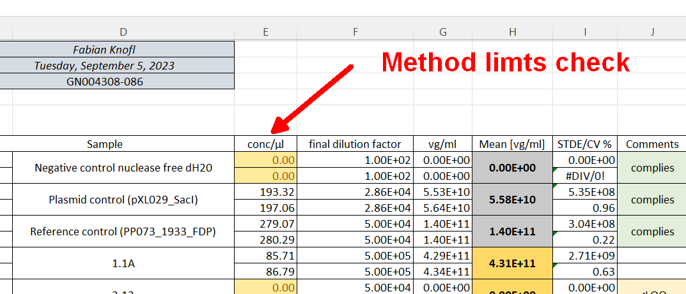
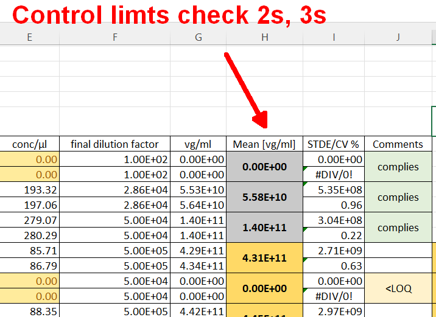

# PCR  Report Generation

Python project for automatic report generation from PCR measurements.

## Configuration files

### *_conc.csv

Sheet is used as look up table for sample indexing.

File shall contain `sample_id`, `type`,`name`, `dilution` where

- `sample_id`: integer, number of sample
- `type`: string, sample ty on of
  - `nc`: negative control
  - `pc`: plasmid control
  - `s`: sample
  - **TODO: add if necessary, shall be added to the code!**
- `name`: string, sample name
- `dilution`: float, final dilution

## Prerequisities

To install python libraries use

```bash
pip install -r requirements.txt```
```

Install `pandoc` frpm [pandoc](https://pandoc.org/installing.html) website.  

Install `latex` from any of the [distributions](https://www.latex-project.org/get/#tex-distributions).  

## Buld distribution of `pcrep`

For experts only!  
To build a `pcrep` library execute following command:

```bash
python -m build --sdist --wheel
```

### Running with exported `csv` data

This is a prefered way to run the preocessing of the results and following report generation.

```bash
python todo.py param
```

## Check the data

### Method check

Method check is applied to original device output data column `Conc(copies/µL)` using data from file `./data/method_limits.csv`.



### Number of droplets check

NUmber of droplets check is defined by minimum number of total droplets and is applied to column `Accepted Droplets` of the device original data.

### Control limit checks

Controll limits checkare aplliet to reference `rc` and plasmid control `pc`. Column used for check is computed method result `vg/ml`.


### Coefficient of variation (CV)

Is applied to multiple target PRC samples and controls plasmid control `pc` and reference control `rc`.

## Notes

- same units everywhere (SOP SOP-051000) [vg/μl]; excell [ml]
- look up tables: thinking in 'computer / programmer' way so that thinks could be indexed, automatically found (sample types, ...)
- CSV delimiter
- unify naming convention (lowercase/camelcase, separator, datetime format, ...)
- UNITS: compute in SOP and  device units (shall be the same). Do units conversion at the very end for desired customer output.  
- 