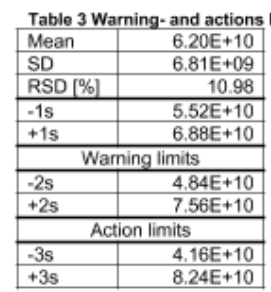
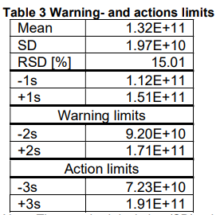
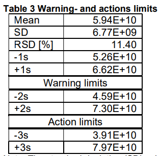
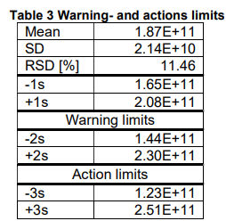

## Experiment Set-Up

See experiment file

## Assessment Criteria

Control Limits
**IDT / ITR**

**plasmid control** pXL29_SacI Lot#190820/01/AL **Reference control**
PP073_1933_FDP

**IDT** (GN000168-014) **IDT** (GN000168-021)




**ITR (**GN000168-003) **ITR (**GN000168-007)




\* The control charts for applied controls are under development.
Corresponding limits will be calculated, documented and defined as
assessment criteria for control samples as soon as sufficient control
results are provided.

### Assay validation criteria

- Threshold was defined at:
  - 2000 for HT2, IDT, FVIII, FIX
  - 1000 for FXN-BT
  - 3000 for ITR
- Each target was assessed independently.
- Negative controls (NTC and negative control) remain negative or lie at least 1 logarithimic scale below the lower limit of the given range (in vg/µL).
  - This applies for all samples reflecting either a “fit for purpose” or “qualified for intended use” status.
  - This criterion can be neglected for samples with “for information only” results.

### Sample validation criteria

- The number of generated droplets requires to be \>10 000 (for values implied in the analysis).
- The coefficient of variation is required to be ≤20% for tested samples. There is no limit or no acceptance criteria regarding the coefficient of variation for negative controls or for samples with a result below the detection limit.

> **Method Range for “Fit for purpose” Samples:**
>
> Measured concentrations in vg/µL need to lie within the following
> defined ranges:

- Huntington: **10 vg/µL to 4690 vg/µL** (\<10 vg/µl =\< LOQ=5, 00E+09 vg/ml)
- ID Tag: **15 vg/µL to 3360 vg/µL** (\<15vg/µl=\<LOQ= \< 7,50E+09vg/ml)
- FIX: **17 vg/µL to 2675 vg/µL** (\<17vg/µl=\<LOQ= \< 8,50E+09vg/ml)
- FVIII/ITR</u>: **15 vg/µL to 3360 vg/µL** (\<15vg/µl=\<LOQ= \< 7,50E+09vg/ml)

> Those limits can be neglected for samples with a “for information
> only” result.
>
> For further target specific criteria, see SOP-051000.

# Result Calculation

Final results are defined by the concentration of the vector genome per
milliliter (vg/mL) present in the sample.

Measured values are displayed by the software in vg/µL.

Calculation of the final result occurs by following the formula below.

All dilution factors implied during sample preparation are considered in
the formula which converts the final result into vg/mL.

| **X\[vg / ml\]</sub> = \[(A \* Y) \* (1000 / B)\] \* D** |
|-----------------------------------------------------------|

**X = Concentration of the vector genome per milliliter \[vg/mL\]**  
**A =** ddPCR Volume = 20 µL  
**Y =** ddPCR Readout = vg/µL (Software Quantasoft)  
**1000 =** Converting factor from µl to mL  
**B =** Sample volume in the ddPCR reaction = 2 µL  
**D =** final dilution factor of the sample  
```
  1:2 (10 µL sample + 10 µL DNase)
  1:5 (20 µL sample + 6 µL EDTA + 74 µL ddPCR Pluronic dilution buffer)
  1:ZZ (100 µL sample + specific dilution factor, see experiment file)
```

# Comments

Final ITR Bridging:

Results see in the attachments file

# List of Attachments

GN004308-086 – attachments.pdf  
GN004308-086 – experiment.pdf  
GN004308-086 – datafile.docx  

Run file is archived in OpenLAB ECM.
